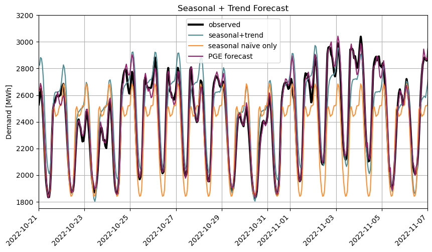

## [Energy Demand Forecasting Model](https://nbviewer.org/github/jackie-kinsler/energy_analysis/blob/master/energy_analysis.ipynb#gathering_data)
#### Predictors: Temperature, time of day, day of week
#### Forecast: Energy Demand

This project creates a simple demand forecast model using Portland General Electric's demand data (from the Energy Information Administration's website).  

The forecasting model is created using time series decomposition and simple regressions. 

Results preview: 

Analysis is done in a Jupyter Notebook using Python, pandas, NumPy, scikit-learn, and matplotlib. 

Forecasting energy demand can be fairly accurate because: 
1. There is a good understanding of factors related to demand (temperature, seasonality, etc.)
2. There is a lot of data available. On EIA, there is 8 years of hourly PGE data. 
3. It is likely that future behavior will be similar to past behavior. 
4. Forecasts aren't too dependent on customer behavior, trends will likely remain similar through price increases and price fluctuation of other fuel sources. 

### Steps in Forecasting
1. Problem definition 
- Create a model to predict hourly energy demand 
2. Gathering information 
- Gather data from the EIA as well as historic weather data
- Gather information from the EIA about how  the data is collected, definitions, etc. 
3. Preliminary analysis 
- Start with basic graphs. View the time plots of the weather and demand data. Find any trends or patterns. Identify if seasonality is important. 
- Are there any outliers or unexpected trends? 
4. Choosing and fitting models 
- Try various fits. For example, regressions, ARIMA, residual study, etc 
5. Using and evaluating a forecasting model 
- Try out the forecasting model. Test it on data that was NOT used to generate the model. How can we quantify how accurate the model is? 

### Time Series Forecasting in Python 
Some methods for time series forecasting are not natively available in Python libraries. So, I will import modules written by [Michael Richman](https://github.com/zgana).

The import files with Michael Richman's code are `utils.py` and `simpletsmodel.py`.  
^Much of this code is from [this project](https://github.com/zgana/fpp3-python-readalong) which attempts to recreate examples from [Forecasting: Principles and Practice (Hyndman and Athanasopoulos)](https://otexts.com/fpp3/) in Python (rather than R). 

### Using EIA for energy data 
To use EIA for energy data, first, generate an API key using this link: 
https://www.eia.gov/opendata/register.php

Save the api key to an `.env` file in your project directory. 
The file should have a format similar to a bash environmental variable: 

EIA_API_KEY=your_key

This will later be sourced by the notebook. 

### Creating GET requests for EIA data 

EIA has a helpful [API browser](https://www.eia.gov/opendata/browser/) with a GET request formulator. 

For this project, the following is used:

API ROUTE:  
- Electricity
- Electric Power Operations (Daily and Hourly) 
- Hourly Demand, Demand Forecast, Generation, And Interchange  

Frequency: 
- Hourly
- Start: January 1, 2022
- End: December 31, 2022  

Filtered by:
- Balancing Authority / Region: (PGE) Portland General Electric Company

These filters generate an **API URL** of:  
`https://api.eia.gov/v2/electricity/rto/region-data/data/?frequency=hourly&data[0]=value&sort[0][column]=period&sort[0][direction]=desc&offset=0&length=5000`

The API key needs to be added to all EIA urls. Add it immediately after the `?` symbol (which delimits the boundary between the URI object and query parameters). 

It becomes:  
`https://api.eia.gov/v2/electricity/rto/region-data/data/?api_key={EIA_API_KEY}&frequency=hourly&data[0]=value&sort[0][column]=period&sort[0][direction]=desc&offset=0&length=5000`

## Definitions from Hourly Electric Grid Monitor (EIA-930 data)
"Form EIA-930 data collection provides a centralized and comprehensive source for hourly operating data about the high-voltage bulk electric power grid in the Lower 48 states."
You can read more Form DIA-930 data collection [here](https://www.eia.gov/electricity/gridmonitor/about). 

"Balancing Authorities (BAs)... are mainly responsible for balancing electricity supply, demand, and interchange on their electric systems in real time."

"**Demand** is a calculated value representing the amount of electricity load within a BA's electric system. A BA derives its demand value by taking the total metered net electricity generation within its electric system and subtracting the total metered net electricity interchange occurring between the BA and its neighboring BAs."

"**Demand forecast:** Each BA produces a day-ahead electricity demand forecast for every hour of the next day. These forecasts help BAs plan for and coordinate the reliable operation of their electric system."

"**Net generation and net generation by energy source:** Net generation represents the metered output of electric generating units in a BA's electric system. This generation only includes generating units that are managed by a BA or whose operations are visible to a BA."

**TIME REPORTING**   
**period** is a time-weighted hourly average value. Data are published at the **end** of the hour. "For example, the data for the hour ending 1:00 a.m. on August 1, 2019, is reported with a timestamp of August 1, 2019, 1:00 a.m." Data is reported in local timezones. So, **PGE's data, it is reported in Pacific Time (PT).**

Source: https://www.eia.gov/electricity/gridmonitor/about
